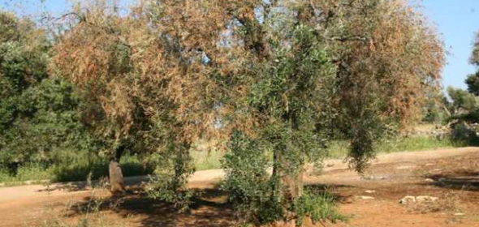

```{r include=FALSE}
knitr::opts_chunk$set(echo = TRUE, 
                      warning = FALSE, 
                      message = FALSE, 
                      eval=FALSE, 
                      fig.width = 12, 
                      fig.height = 8)
options(width = 90)
library(tidyverse)
```

```{r, include=FALSE}
knitr::opts_chunk$set(echo = TRUE)
```

# Incidencia y severidad 

## Olivo / bacteriosis 



Chequeamos cuántos árboles fueron evaluados en cada año/región/lote:

```{r}
ftable(xtabs(~year+loc+farm, oli_long))
```

Imprimimos los 30 árboles de un mismo lote 

```{r}
oli_long %>% 
  arrange(loc, year) %>% 
  print(n=30)
```

Incidencia (nivel lote - evolución interanual)

```{r}
dat_inc <- oli_long %>%
  group_by(year, loc, farm) %>%
  summarise(inc = mean(sev>0, na.rm=TRUE)*100) %>% 
  ungroup %>% 
  arrange(loc, year)
dat_inc
```

```{r}
ggplot(dat_inc, aes(x=factor(year), y=inc, color=factor(farm))) +
  geom_point() +
  geom_line(aes(group=farm)) +
  facet_grid(. ~ loc)
```


Prevalencia (nivel región - evolución interanual)

```{r}
dat_prev  <- dat_inc %>%
  group_by(year, loc) %>%
  summarise(prev = trunc(mean(inc>0, na.rm=TRUE)*100)) %>% 
  ungroup %>% 
  arrange(loc,year)
dat_prev
```

```{r}
ggplot(dat_prev, aes(x=factor(year), y=prev, color=factor(loc))) +
  geom_point() +
  geom_line(aes(group=loc))
```
