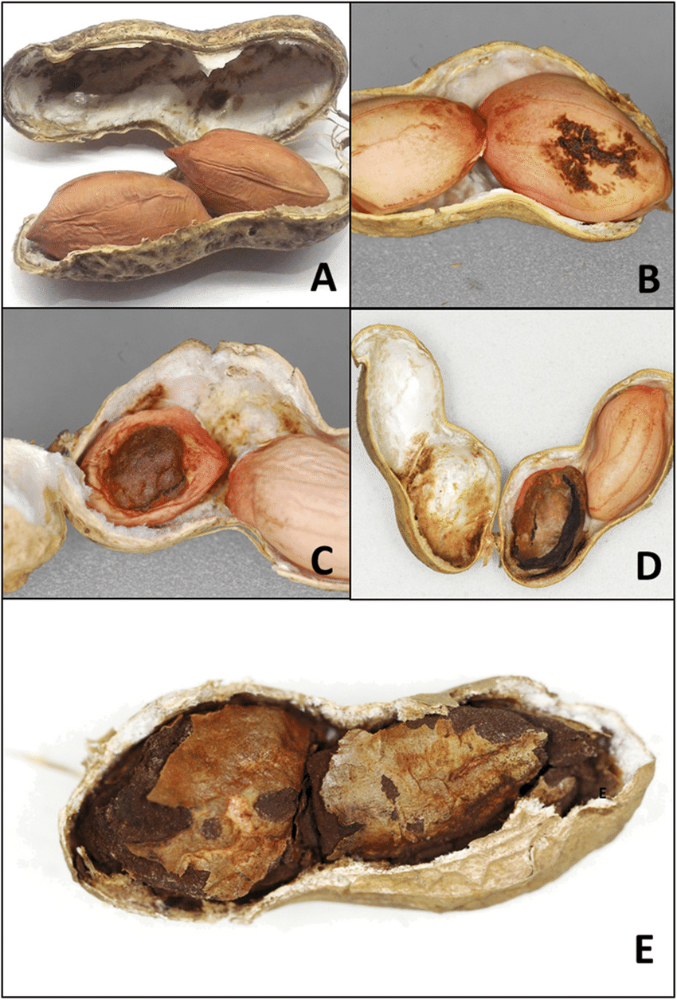

```{r include=FALSE}
knitr::opts_chunk$set(echo = TRUE, 
                      warning = FALSE, 
                      message = FALSE, 
                      eval=FALSE, 
                      fig.width = 12, 
                      fig.height = 8)
options(width = 90)
library(tidyverse)
```

# Indice de severidad 

## Maní/carbón  

{width=200px}

```{r}
url_mani <- "https://docs.google.com/spreadsheets/d/1QJuQ2Zm26ufVYklB7vak6gQej3Xtyvbtj1yPKDlczD0/edit#gid=0"

mani <- gsheet::gsheet2tbl(url_mani)

url_mani <- url_mani %>% 
  mutate_at(vars(c("trt", "sprays", "bk")),funs(factor)) 

mani
```

Exploramos cuántas plantas (sub-muestra) fueron evaluadas por parcela:

```{r}
mani %>%
  group_by(trt, sprays, bk)%>%
  summarise(n=n()) #%>% knitr::kable()
```

Calculamos la incidencia por parcela y agregamos una columna para identificar a la planta como sub-muestra dentro de cada parcela:

```{r}
mani1 <- mani %>% 
  mutate(
    trt = relevel(trt, ref="check"),
    dis_pod = rowSums(select(., matches('x1|x2|x3|x4'))),
    inc = dis_pod/n_pods,
    x0_p = rowSums(select(., matches('x0')))/n_pods,
    x3.4 = rowSums(select(., matches('x3|x4'))), 
    sev0_1 = (0*x0 + 0.01*x1 +0.1*x2 + 0.7*x3 + 1*x4)/ n_pods) %>% 
  group_by(sprays, trt, bk) %>%
  mutate(sample = row_number()) %>% 
  
  # filter(sprays!=1, 
  #        trt!="Epoxiconazole") %>%
  ungroup 

mani1
```


